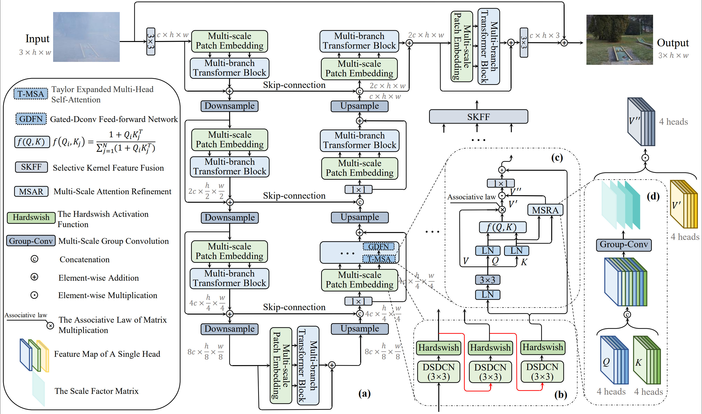

# MB-TaylorFormer: Multi-branch Efficient Transformer Expanded by Taylor Formula for Image Dehazing （ICCV 2023）
<font color="red">**We have released MB-TaylorFormer V2 (TPAMI), which achieves improved performance and extends its application to more tasks, including deblurring, denoising, deraining, dehazing, and desnowing.**</font>
<font color=#FF0000>Paper: https://arxiv.org/abs/2501.04486</font>
<span style="color:red">这段文字是红色的</span>
<font color="red">**GitHub: https://github.com/FVL2020/MB-TaylorFormerV2**</font>

This repository contains the official implementation of the following paper:
> MB-TaylorFormer: Multi-branch Efficient Transformer Expanded by Taylor Formula for Image Dehazing<br>
> [Yuwei Qiu](https://arxiv.org/search/cs?searchtype=author&query=Qiu%2C+Y), [Kaihao Zhang](https://arxiv.org/search/cs?searchtype=author&query=Zhang%2C+K), [Chenxi Wang](https://arxiv.org/search/cs?searchtype=author&query=Wang%2C+C), [Wenhan Luo](https://arxiv.org/search/cs?searchtype=author&query=Luo%2C+W), [Hongdong Li](https://arxiv.org/search/cs?searchtype=author&query=Li%2C+H), [Zhi Jin](https://arxiv.org/search/cs?searchtype=author&query=Jin%2C+Z)<sup>*</sup><br>
> International Conference on Computer Vision (ICCV), 2023<br>
**Paper Link:** [[official link](https://arxiv.org/abs/2308.14036)]

**supplementary material Link:** [[Google Drive](https://drive.google.com/file/d/11HZeR44TpOVNSdC8loEbgSENNfHel6BC/view?usp=drive_link)] 

 Join our talk on Tencent Meeting! Meeting ID: 460599803, Password: 231119. Let's connect, learn, and have a great discussion. See you there! 

## Overview

Architecture of MB-TaylorFormer. (a) MB-TaylorFormer consists of a multi-branch hierarchical design based on multi-scale patch embedding. (b) Multi-scale patch embedding embeds coarse-to-fine patches. (c) TaylorFormer with linear computational complexity. (d) MSAR module compensates for errors in Taylor expansion.

## Installation

See [INSTALL.md](https://github.com/swz30/Restormer/blob/main/INSTALL.md) for the installation of dependencies required to run MB-TaylorFormer.


## Prepare pretrained models
Before performing the following steps, please download our pretrained model first.

 **Download Links:** [[Google Drive](https://drive.google.com/drive/folders/1a01P025U6VoEOJZZr09Dew7T2epgb7D_?usp=drive_link)]

Then, place the models to `dehazing/pretrained_models` directory.

Run the following command to process them:
```shell
CUDA_VISIBLE_DEVICES=X python dehazing/test.py --size ['B' or 'L'] --input_dir [Input path] --target_dir [GT path] --result_dir [Result path] --weights [Model weighting path]
```
For example:

```
CUDA_VISIBLE_DEVICES=0 python dehazing/test.py --size 'B'  --input_dir '/data/QYW/ITS_SOTS/test/hazy/' --target_dir '/data/QYW/ITS_SOTS/test/GT/' --result_dir '/data/qiuyuwei/ITS_result' --weights '/home/qiuyuwei/MB-TaylorFormer-main/Dehazing/pretrained_models/ITS-MB-TaylorFormer-B.pth'
```

## Prepare dataset for training and evaluation
 **Download Links:** [[Google Drive](https://drive.google.com/drive/folders/1mHr9p-c895tFtyRLz1JEeEGAurTmj_v-?usp=drive_link)] (ITS, SOTS, OHAZE, Dense-haze)
 
 **Download Links:** [[official link](https://sites.google.com/view/reside-dehaze-datasets)] (OTS)
 
The `data` directory structure will be arranged as: 
```
data
   |- ITS
      |- Trai
      	|- Haze
        	|- 1_1_0.90179.png 
        	|- 2_1_0.99082.png
        |- GT
        	|- 1.png 
        	|- 2.png
      |- Test
      	|- Haze
        	|- 00001.png
        	|- 00002.png
        |- GT
        	|- 00001.png
        	|- 00002.png
   |- OTS
      |- Train
      	|- Haze
        	|- 0001_0.85_0.04.jpg
        	|- 0002_0.85_0.04.jpg
        |- GT
        	|- 0001.jpg
        	|- 0002.jpg
      |- Test
      	|- Haze
        	|- 00501.png
        	|- 00502.png
        |- GT
        	|- 00501.png
        	|- 00502.png
   |- Dense-Haze
      |- Train
         |- Haze
            |- 01_hazy.png 
            |- 02_hazy.png
         |- GT
            |- 01_GT.png 
            |- 02_GT.png
      |- Test
         |- Haze
            |- 51_hazy.png 
            |- 52_hazy.png
         |- GT
            |- 51_GT.png 
            |- 52_GT.png

   |- O-HAZE
      |- Train
         |- Haze
            |- 01_outdoor_hazy.jpg
            |- 02_outdoor_hazy.jpg
         |- GT
            |- 01_outdoor_GT.jpg 
            |- 02_outdoor_GT.jpg
      |- Test
         |- Haze
            |- 41_outdoor_haze.jpg
            |- 42_outdoor_haze.jpg
         |- GT
            |- 41_outdoor_GT.jpg
            |- 42_outdoor_GT.jpg


```


## Training

To train MB-TaylorFormer with default settings, run

```
sh /train.sh Dehazing/Options/MB-TaylorFormer-B.yml 
```

or

```
sh /train.sh Dehazing/Options/MB-TaylorFormer-L.yml
```

## Testing

Run the following command to quick test:

```shell
CUDA_VISIBLE_DEVICES=X python dehazing/test.py --size ['B' or 'L'] --input_dir [Input path] --target_dir [GT path] --result_dir [Result path] --weights [Model weighting path]
```

For example:

```
CUDA_VISIBLE_DEVICES=0 python dehazing/test.py --size 'B'  --input_dir '/data/QYW/ITS_SOTS/test/hazy/' --target_dir '/data/QYW/ITS_SOTS/test/GT/' --result_dir '/data/qiuyuwei/ITS_result' --weights '/home/qiuyuwei/MB-TaylorFormer-main/Dehazing/pretrained_models/ITS-MB-TaylorFormer-B.pth'
```

## Results
**Download Links:** [[Google Drive](https://drive.google.com/drive/folders/11RTuBBhrhFMXlnMx44v24AdukAMW-8IA?usp=drive_link)]


## Citation

   If you find our repo useful for your research, please consider citin our paper:

   ```bibtex
    @misc{2308.14036,
    Author = {Yuwei Qiu and Kaihao Zhang and Chenxi Wang and Wenhan Luo and Hongdong Li and Zhi Jin},
    Title = {MB-TaylorFormer: Multi-branch Efficient Transformer Expanded by Taylor Formula for Image Dehazing},
    Year = {2023},
    Eprint = {arXiv:2308.14036},
    }	
   ```
## Contact

If you have any question, please feel free to contact us via `qiuyw9@mail2.sysu.edu.cn` or `jinzh26@mail2.sysu.edu.cn`.

## Acknowledgments

This code is based on [Restormer](https://github.com/swz30/Restormer).
